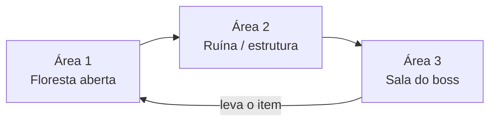

# Escopo da Demo

**Versão:** 0.1 · **Status:** definido em conjunto (etapa 1) · **Base:** [GDD](GDD.md)

Este documento fecha o que a demo mostra e o que fica de fora. Qualquer item novo só entra se algo sair, ou depois da demo pronta.

---

## 1. Objetivo da demo

Provar que o **combate** e o **ritmo de uma região** funcionam: explorar, lutar, ganhar uma arma nova que muda o estilo de combate, vencer um boss e voltar com o item.

A demo **não** tenta provar a narrativa de múltiplas perspectivas. Essa parte vem depois.

**Duração alvo:** 10 a 15 minutos para quem joga pela primeira vez.

---

## 2. Personagem

- Um dos protagonistas da história principal, com design e jogabilidade próximos da versão final.
- **Sugestão:** o **Homem-gato** (GDD 12.4). Ele já é descrito como híbrido de corpo a corpo e distância com uma arma tecnológica, o que casa com a virada da demo. *(A confirmar pelo game design.)*
- Começa só com as **habilidades de raça**.
- No meio da demo, encontra uma **arma que muda a mecânica de combate**: por exemplo, de corpo a corpo para ataque à distância.

### Mecânicas previstas (detalhes na especificação de gameplay, etapa 2)

| Mecânica | Na demo | Observação |
|---|---|---|
| Movimento em 8 direções | ✅ | |
| Dash | ✅ | Consome stamina |
| Stamina | ✅ | |
| Ataque corpo a corpo | ✅ | Combo a definir |
| Escudo / defesa | ✅ | |
| Parry | ✅ | Parry perfeito atordoa o inimigo e aumenta a chance de crítico |
| Ataque à distância | ✅ | Só depois de pegar a arma |
| Pulo | ❓ | A definir. Afeta o level design (buracos, desníveis) |
| Habilidades específicas | ❓ | Quais entram na demo? |

---

## 3. Estrutura da demo

### Área 1: Floresta (parte aberta)
- Mapa **maior que a tela**, com câmera seguindo o personagem. Não precisa ser gigante.
- **Parte segura:** o personagem chega a uma área nova e encontra um **NPC**. Aparece a caixa de diálogo, e o NPC diz o que ele precisa fazer. Aqui também fica a **fogueira** *(confirmar se ela serve de checkpoint)*.
- **Parte de combate:** avançando, surgem os inimigos.
  - **Leva 1:** testa a mecânica base do personagem.
  - **Leva 2:** mistura os tipos de inimigo *(opcional)*.
- No fim da área, o caminho leva à entrada de uma estrutura.

### Área 2: Ruína / base abandonada (interna)
- Menor que a floresta, com **obstáculos** (colunas, paredes, estátuas etc., a definir pelo concept).
- Logo na entrada, o personagem **acha a arma**: num corpo no chão ou em destaque.
- Em seguida, **semi-boss + minions**.

### Área 3: Boss
- Ao derrotar o semi-boss, aparece o **boss**, na mesma área ou numa sala separada *(a definir)*.
- O boss **dropa um item**.

### Final
- O jogador **leva o item de volta ao NPC** do início.
- Fim da demo.

---

## 4. O que ESTÁ na demo

- 1 personagem jogável, próximo da versão final
- 3 áreas: floresta, ruína e sala do boss (ou 2, se o boss ficar na ruína)
- 1 NPC com diálogo simples no início e no fim
- Inimigos comuns: **3 tipos** (definidos na especificação de gameplay)
- 1 semi-boss com minions
- 1 boss com padrões de ataque próprios
- 1 arma que muda o estilo de combate
- 1 item de missão (drop do boss)
- HUD mínimo: vida, stamina e munição/energia (se a arma usar)
- Menu de **pausa** (pausar e continuar)
- Feedback visual e sonoro em toda ação (ver seção 6)

## 5. O que NÃO está na demo

- Outros protagonistas
- Árvore de skills e progressão (XP, níveis, moeda)
- Inventário e sistema de equipamentos
- Narrativa, lore e contexto do mundo (o NPC só explica a tarefa)
- Múltiplas perspectivas
- Menus completos (opções, save, seleção de personagem)
- Puzzles *(confirmar)*
- Side quests e segredos
- Arte final em tudo. A demo pode ter partes com arte provisória, desde que o personagem esteja próximo do final.

---

## 6. Regras de experiência

### 6.1 Todo evento tem resposta
Tudo o que acontece precisa de um sinal visual **e** sonoro, mesmo que provisório. No protótipo, som feio e efeito simples já servem: o importante é o jogador perceber que aquilo aconteceu.

| Evento | Visual (protótipo) | Som (protótipo) |
|---|---|---|
| Acertar inimigo | Inimigo pisca branco, empurrão, micro-pausa (hitstop) | "tic" curto |
| Crítico | Número/efeito maior, tremida de tela | Som mais grave |
| Tomar dano | Personagem pisca, tela treme, borda vermelha | Som de impacto |
| Parry normal | Faísca no escudo | "clang" |
| Parry perfeito | Flash, pausa mais longa, inimigo atordoado com indicador | "clang" agudo |
| Dash | Rastro (afterimage) | "whoosh" |
| Sem stamina | Barra pisca, ação não sai | Som de falha |
| Inimigo prestes a atacar | Brilho ou pisca vermelho (telegraph) | Aviso curto |
| Inimigo morre | Explosão de partículas | Som de morte |
| Pegar item/arma | Destaque, pausa curta, texto | Jingle |
| Checkpoint | Fogueira acende | Som suave |

### 6.2 O clima é separado por momento
- **Momento leve** (conversa, área segura): só elementos amigáveis na tela. Nada de inimigo à vista enquanto um personagem ri.
- **Momento de tensão** (combate, boss): o oposto.
- A música acompanha essa divisão.

---

## 7. Decisões técnicas propostas

| Tema | Proposta | Motivo |
|---|---|---|
| Engine | **Godot 4** (GDScript) | Grátis, forte em 2D e pixel art, cenas em texto (fácil de versionar) |
| Resolução base | **640×360**, escala inteira até 1280×720 e 1920×1080 | Bate com a escala da imagem de referência de câmera |
| Tile | **16×16 px** | Padrão de pixel art top-down |
| Personagem | ~24 a 32 px de altura | A validar com o concept |
| Controle | Teclado + mouse **e** controle | Mira com mouse ou analógico direito |
| Versionamento | Git + GitHub | |

---

## 8. Pendências

**Do game design (etapa 2):**
- [ ] Especificação de gameplay: personagem, habilidades, regras (pula? atravessa parede?)
- [ ] Os 3 inimigos comuns: comportamento, movimento, ataques
- [ ] Semi-boss e minions
- [ ] Boss: padrões de ataque e fases
- [ ] Qual é a arma e como ela muda o combate
- [ ] Qual é o item do boss
- [ ] Concept da região da demo (floresta e ruína)

**Para decidir juntos:**
- [ ] A fogueira é checkpoint? Onde o jogador renasce se morrer?
- [ ] O boss fica numa sala separada ou na mesma área do semi-boss?
- [ ] A volta até o NPC é a pé ou por um atalho que se abre?
- [ ] Terá puzzle na ruína?
