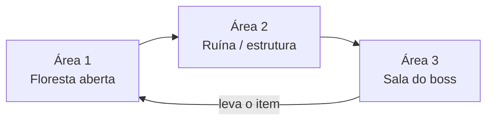

# Escopo da Demo

**Versão:** 0.2 · **Status:** definido em conjunto (etapa 1), atualizado com a especificação da floresta · **Base:** [GDD](GDD.md) e [Game Design da floresta](04-game-design-demo.md)

Este documento fecha o que a demo mostra e o que fica de fora. Qualquer item novo só entra se algo sair, ou depois da demo pronta.

---

## 1. Objetivo da demo

Provar que o **combate** e o **ritmo de uma região** funcionam: explorar, lutar, ganhar uma arma nova que muda o estilo de combate, vencer um boss e voltar com o item.

A demo **não** tenta provar a narrativa de múltiplas perspectivas. Essa parte vem depois.

**Duração alvo:** 10 a 15 minutos para quem joga pela primeira vez.

---

## 2. Personagem

- **Homem-gato** (GDD 12.4), confirmado na [especificação da floresta](04-game-design-demo.md). É ágil, bondoso, fala rápido e mia no fim de algumas frases.
- Tem **10 de HP** e **4 unidades de stamina**. Depois de tomar dano, fica 1 s invulnerável (pode atacar e dar dash).
- Começa só com as habilidades próprias: garras, espada, dois tipos de dash e parry.
- No meio da demo, dentro da ruína, encontra a arma **KLM-99**, que libera o ataque à distância.

### Mecânicas

| Mecânica | Na demo | Como funciona |
|---|---|---|
| Movimento em 8 direções | ✅ | Setas. 1,3 × a velocidade padrão |
| Dash ofensivo | ✅ | Tecla D. Gasta 2 de stamina, atravessa inimigos causando 1 de dano em cada um, sem empurrão e sem invulnerabilidade. Para no contato com parede ou obstáculo |
| Dash de rolamento | ✅ | Tecla S alterna o tipo. Mais curto, sem dano. Não atravessa inimigos: para no contato com parede, obstáculo ou inimigo. Esquiva de projéteis (a língua). Os 2 primeiros em 5 s são grátis, o terceiro gasta 1 de stamina (e é bloqueado sem stamina) |
| Escalada | ✅ | Dash ofensivo (2 de stamina) contra trechos marcados da parede da ruína leva à área superior |
| Stamina | ✅ | 4 unidades. Só os dashes gastam |
| Ataque corpo a corpo | ✅ | Tecla A. Combo cíclico de 3 golpes (1 → 2 → 3 → 1…, nunca reseta): garra, garra, espada (dano 1, 1, 2). Cada golpe dura 0,308 s, com antecipação (o dash cancela), execução e recuperação. Mira com magnetismo (cone de ±45°) |
| Parry | ✅ | Tecla Q, janela de 0,2 s. Se acertar, o inimigo fica 0,5 s atordoado, o gato chuta, o inimigo é lançado e fica mais 1,5 s atordoado. Se errar, 0,4 s sem poder repetir. O dash cancela a animação |
| Escudo / defesa contínua | ❌ | Não existe. A defesa é só o parry no tempo certo |
| Interação | ✅ | Tecla E. Algumas interações são sinalizadas, outras são ocultas |
| Ataque à distância | ✅ | Só depois de pegar a KLM-99, na ruína. Especificação pendente |
| Pulo | ❌ | Não há pulo. A subida é pela escalada com dash |

---

## 3. Estrutura da demo

### Área 1: Floresta
Especificação completa em [04-game-design-demo.md](04-game-design-demo.md). A floresta tem cinco partes, cerca de 7,5 telas no total:
- **Área segura (1 tela):** encontro com **Xennar**, o velho responsável pelo farol. Ele pede que o gato recupere o **cajado** roubado pelas criaturas. Tem a fogueira, que é só ambientação: **não é checkpoint**.
- **Corredor (1 tela):** passagem entre árvores, sem combate.
- **Clareira (1,5 tela):** estátua da Guardiã e o primeiro combate contra os sapos.
- **Exterior da ruína (2 a 2,5 telas):** área aberta, combate contra grupos, acesso à escalada e entrada da ruína.
- **Área superior (1,5 tela):** opcional, alcançada pela escalada. Tem inimigos e a peça de upgrade da KLM-99.
- **Inimigos:** sapo comum (ataca pulando) e sapo com língua (ataca com a língua, que pode ser rebatida no parry).
- **Se o jogador morrer**, a demo recomeça do início da fase.

### Área 2: Ruína / base abandonada (interna)
- Menor que a floresta, com **obstáculos** (colunas, paredes, estátuas etc., a definir pelo concept).
- Logo na entrada, o personagem **acha a arma**: num corpo no chão ou em destaque.
- Em seguida, **semi-boss + minions**.

### Área 3: Boss
- Ao derrotar o semi-boss, aparece o **boss**, na mesma área ou numa sala separada *(a definir)*.
- O boss é o **líder das criaturas** e está com o **cajado de Xennar**.

### Final
- O jogador **leva o cajado de volta a Xennar**.
- Fim da demo.

---

## 4. O que ESTÁ na demo

- 1 personagem jogável, próximo da versão final
- 3 áreas: floresta, ruína e sala do boss (ou 2, se o boss ficar na ruína)
- 1 NPC (Xennar) com diálogo no início e no fim
- Inimigos comuns: **sapo comum** e **sapo com língua** na floresta. Os da ruína ainda serão definidos
- Itens de exploração opcionais: flor de lírio azul, elemento tecnológico, estátua da Guardiã e peça de upgrade
- 1 semi-boss com minions
- 1 boss com padrões de ataque próprios
- 1 arma que muda o estilo de combate: a **KLM-99**
- 1 item de missão: o **cajado de Xennar**
- HUD mínimo: HP (10 unidades), stamina (4 unidades laranja), tipo de dash equipado e, depois da arma, munição/energia
- Menu de **pausa** (pausar e continuar)
- Feedback visual e sonoro em toda ação (ver seção 6)

## 5. O que NÃO está na demo

- Outros protagonistas
- Árvore de skills e progressão (XP, níveis, moeda)
- Inventário e sistema de equipamentos
- Narrativa e lore completos. A demo tem só o pedido de Xennar e pequenas falas do gato
- Checkpoints. Morrer recomeça a fase
- Múltiplas perspectivas
- Menus completos (opções, save, seleção de personagem)
- Puzzles *(confirmar para a ruína)*
- Side quests
- Arte final em tudo. A demo pode ter partes com arte provisória, desde que o personagem esteja próximo do final.

---

## 6. Regras de experiência

### 6.1 Todo evento tem resposta
Tudo o que acontece precisa de um sinal visual **e** sonoro, mesmo que provisório. No protótipo, som feio e efeito simples já servem: o importante é o jogador perceber que aquilo aconteceu.

| Evento | Visual (protótipo) | Som (protótipo) |
|---|---|---|
| Acerto | Inimigo pisca branco, empurrão, hitstop | Impacto curto |
| Dano recebido | Personagem pisca, tela treme, borda vermelha | Impacto |
| Parry | Faísca, chute, inimigo lançado e atordoado | Clang |
| Dash | Rastro (afterimage) | Whoosh + rosnado |
| Sem stamina | Barra pisca, ação não sai | Som de falha |
| Inimigo atacando | Telegraph: squash ou vibração do sprite | — |
| Morte do inimigo | Partículas, sprite fica no chão | Som de morte |
| Interação | Indicador E | Som de interação |
| Coleta | Destaque, pausa curta, texto | Jingle |
| Escalada | Indicador D | Som de movimento |

### 6.2 O clima é separado por momento
- **Momento leve** (conversa, área segura): só elementos amigáveis na tela. Nada de inimigo à vista enquanto um personagem ri.
- **Momento de tensão** (combate, boss): o oposto.
- A música acompanha essa divisão.

---

## 7. Decisões técnicas propostas

| Tema | Proposta | Motivo |
|---|---|---|
| Engine | **Godot 4** (GDScript) | Grátis, forte em 2D e pixel art, cenas em texto (fácil de versionar) |
| Resolução base | **640×360**, ampliada 3× (1920×1080) com escala inteira | Pixel art com os pixels visíveis, definido pelo game design em 30/09 |
| Tile | **16×16 px** na arte (48 px na tela) | A tela tem 40 × 22,5 tiles |
| Personagem | Tamanho 3 (padrão) = **50 px** na arte, 150 px na tela. Homem-gato, tamanho 2 = 42 px | 50 px definido pelo game design. Os 42 px são proposta |
| Controle | Teclado: setas, A, S, D, Q e E | Definido na especificação. Suporte a gamepad a confirmar |
| Versionamento | Git + GitHub | |

---

## 8. Pendências

**Do game design (etapa 2):**
- [x] Especificação da floresta: personagem, mecânicas, sapos, Xennar, interações e mapa
- [ ] Responder as [dúvidas em aberto](04-game-design-demo.md#50-dúvidas-em-aberto) da especificação da floresta
- [ ] Especificação da ruína: a KLM-99, os inimigos, o semi-boss e os minions
- [ ] Boss (líder das criaturas): padrões de ataque e fases
- [ ] Concept da região da demo (floresta e ruína)

**Já decidido:**
- [x] A fogueira não é checkpoint. Morrer recomeça a fase
- [x] Não há pulo. A subida é pela escalada com dash
- [x] O item da missão é o cajado de Xennar

**Para decidir juntos:**
- [ ] O boss fica numa sala separada ou na mesma área do semi-boss?
- [ ] A volta até Xennar é a pé ou por um atalho que se abre?
- [ ] Terá puzzle na ruína?
- [ ] Sem checkpoint, morrer no boss obriga a refazer a floresta e a ruína inteiras. Vale um ponto de retorno na entrada da ruína?
