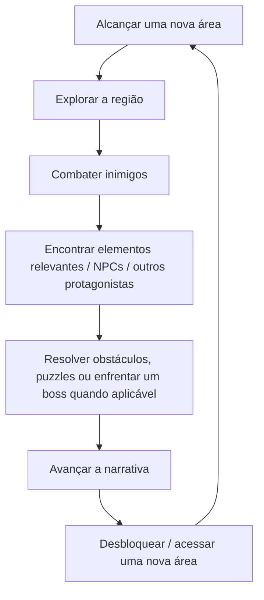

# GDD — [NOME PROVISÓRIO]

> **Documento vivo.** Esta é a versão editável do GDD. Qualquer pessoa do projeto pode alterar este arquivo. Ao mudar algo, registre no [Histórico de versões](#histórico-de-versões) no fim do documento.
> A versão original em PDF continua guardada em [referencias/GDD-v0.1.pdf](referencias/GDD-v0.1.pdf).

| | |
|---|---|
| **Versão** | 1.0 |
| **Status** | Conceito / Pré-produção |
| **Gênero** | Action-Adventure / RPG |
| **Perspectiva** | Top-down |
| **Estilo visual** | Pixel art |
| **Plataforma** | A definir |
| **Desenvolvedor** | A definir |

---

## 1. Visão Geral

[NOME PROVISÓRIO] é um jogo de ação e aventura top-down ambientado em um mundo de fantasia onde magia e tecnologia coexistem, mas são sistemas distintos.

O jogador acompanha diferentes protagonistas pertencentes a diferentes raças, culturas e contextos. Cada protagonista possui sua própria campanha, perspectiva narrativa, habilidades, árvore de skills e estilo de gameplay.

As campanhas acontecem dentro de uma **mesma continuidade narrativa**. Alguns personagens vivem acontecimentos simultaneamente em lugares diferentes, enquanto outros podem estar envolvidos em eventos ocorridos no passado.

A mesma história é, portanto, construída através de múltiplas perspectivas.

Um acontecimento visto em uma campanha pode ganhar um novo significado quando o jogador o encontra novamente em outra. Um personagem pode passar por um local que outro protagonista visitará posteriormente, provocar uma mudança no ambiente que será percebida por outro personagem ou simplesmente testemunhar uma parte de um acontecimento que o outro nunca viu.

A intenção é que o jogador gradualmente construa uma compreensão maior do mundo ao **conectar os acontecimentos das diferentes campanhas**.

---

## 2. Pilares de Design

### 2.1. Múltiplas perspectivas

A narrativa não deve depender de um único protagonista.

Cada personagem apresenta apenas uma parte da história e possui conhecimentos, crenças, experiências e limitações próprias.

O jogador deve ser incentivado a comparar o que viu em diferentes campanhas.

### 2.2. Um único mundo

As campanhas não devem parecer histórias independentes ambientadas no mesmo universo.

Elas acontecem dentro de um **mesmo mundo e continuidade temporal**.

Eventos podem produzir consequências que serão encontradas posteriormente por outro protagonista.

Exemplos:

- uma ponte destruída em uma campanha aparece destruída em outra;
- um NPC conhecido por um protagonista aparece posteriormente em outro contexto;
- uma região pode ser visitada por diferentes personagens em momentos distintos;
- um boss pode ser enfrentado por um protagonista enquanto outro está em outra parte da região;
- um personagem pode chegar a um local depois que outro já causou mudanças ali.

### 2.3. Gameplay específica por protagonista

Todos os personagens compartilham uma base comum de movimentação e interação, mas cada campanha deve possuir uma identidade mecânica própria.

Cada protagonista possui:

- conjunto de habilidades próprio;
- árvore de skills própria;
- estilo de combate próprio;
- características derivadas de sua raça;
- características individuais;
- equipamentos e ferramentas específicos ou parcialmente específicos.

A intenção não é criar simplesmente diferentes "classes", mas personagens que proporcionem experiências significativamente diferentes.

### 2.4. Combate rápido e expressivo

O combate é inspirado principalmente em **Hyper Light Drifter**.

Elementos de referência:

- ritmo rápido;
- movimentação constante;
- dash;
- ataques corpo a corpo;
- armas à distância;
- stamina;
- parry;
- inimigos agressivos;
- combate baseado em posicionamento e timing;
- chefes com padrões e identidade própria.

A implementação exata das mecânicas ainda está em desenvolvimento.

### 2.5. Exploração e aventura

A estrutura de exploração combina a progressão linear de uma aventura como **Eastward** com regiões menores que permitem exploração mais livre.

O jogador segue uma progressão narrativa definida, mas possui liberdade para explorar cada região, encontrar elementos opcionais e descobrir detalhes do mundo.

A exploração deve complementar a narrativa, e não funcionar apenas como deslocamento entre combates.

---

## 3. Referências

### Hyper Light Drifter

Principal referência para:

- combate;
- ritmo;
- movimentação;
- pixel art;
- atmosfera;
- design de inimigos;
- exploração de regiões;
- linguagem visual.

### Eastward

Principal referência para:

- estrutura de aventura;
- apresentação narrativa;
- perspectiva top-down;
- personagens;
- diálogos;
- humor;
- construção gradual do mundo;
- combinação de momentos leves e tensos.

### Black Myth: Wukong

Referência adicional para:

- estrutura de regiões;
- exploração dentro de áreas relativamente delimitadas;
- combinação entre progressão linear e exploração.

As referências não representam uma intenção de reproduzir diretamente esses jogos. O objetivo é combinar elementos de suas respectivas linguagens em uma identidade própria.

Referências visuais: [moodboard](referencias/moodboard.jpg) · [câmera e escala](referencias/referencia-camera-escala.jpg)

---

## 4. Mundo

O jogo se passa em um mundo de fantasia composto por diferentes povos, raças, civilizações e ecossistemas.

Entre os elementos já concebidos estão:

- reinos humanos;
- fortalezas;
- cidades e estruturas de pedra;
- povos da floresta;
- tribos;
- ruínas antigas;
- tecnologia;
- magia;
- diferentes comunidades e culturas.

As sociedades possuem relações diferentes entre si.

Algumas raças e comunidades convivem pacificamente, enquanto outras possuem conflitos, rivalidades ou hostilidade histórica.

---

## 5. Magia e Tecnologia

Magia e tecnologia são **sistemas distintos** dentro do mundo.

Ambos possuem diferentes formas e manifestações.

Alguns povos e indivíduos utilizam predominantemente magia. Outros utilizam tecnologia. Alguns combinam os dois.

A natureza desses sistemas, suas origens e suas relações com as antigas civilizações fazem parte dos elementos que serão descobertos ao longo da narrativa.

**Detalhes a definir:**

- origem da magia;
- origem das tecnologias antigas;
- relação entre as duas;
- nível tecnológico das diferentes civilizações;
- funcionamento das ruínas;
- existência de tecnologias perdidas;
- formas de combinação entre magia e tecnologia.

---

## 6. Estrutura Narrativa

### 6.1. Protagonistas

O jogo terá aproximadamente **cinco protagonistas**.

Cada protagonista terá uma campanha completa.

As campanhas podem possuir diferentes níveis de conexão. Algumas serão fortemente entrelaçadas, enquanto outras acompanharão acontecimentos mais periféricos que posteriormente se revelarão importantes para a compreensão da história maior.

Uma ou mais campanhas também poderão ocorrer em períodos diferentes da linha temporal principal.

### 6.2. Ordem das campanhas

O jogador poderá escolher a ordem em que joga as campanhas.

Cada campanha deve:

- possuir uma narrativa compreensível individualmente;
- possuir desenvolvimento próprio;
- possuir conflitos próprios;
- possuir um desfecho próprio.

Entretanto, a ordem escolhida pelo jogador influencia quais informações ele já conhece.

Consequentemente, algumas revelações terão impactos diferentes dependendo da campanha jogada primeiro.

Isso é uma característica deliberada do design narrativo.

### 6.3. Continuidade

Existe uma única continuidade narrativa.

Não existem múltiplos finais causados pela ordem das campanhas.

Personagens podem alterar acontecimentos durante suas campanhas, mas essas alterações fazem parte da mesma linha narrativa que será observada nas outras campanhas.

### 6.4. Perspectiva

O jogador acompanha os acontecimentos exclusivamente através do protagonista da campanha atual.

Quando dois protagonistas participam de acontecimentos relacionados, o jogador pode posteriormente experimentar aquele contexto novamente através do outro personagem.

O objetivo não é simplesmente repetir cenas, mas revelar **novas informações sobre acontecimentos já conhecidos**.

O jogador pode chegar a reconhecer:

- lugares;
- personagens;
- eventos;
- consequências;
- diálogos;
- acontecimentos anteriores.

Essa familiaridade deve criar uma sensação de descoberta:

> "Eu já estive aqui. Agora quero descobrir o que estava acontecendo do outro lado."

### 6.5. Narrativa fragmentada

A narrativa utiliza deliberadamente informações incompletas.

Uma campanha pode responder uma pergunta enquanto cria outra.

Alguns acontecimentos podem permanecer sem explicação após uma única campanha.

Algumas pontas podem permanecer abertas mesmo após todas as campanhas.

A intenção é incentivar o jogador a:

- prestar atenção aos detalhes;
- comparar acontecimentos;
- interpretar diálogos;
- reconhecer consequências;
- formular teorias;
- discutir e interpretar a história.

O jogo não precisa explicar absolutamente tudo ao jogador.

---

## 7. Core Loop

O ciclo principal de gameplay é:

A proporção entre exploração, combate, narrativa e puzzles ainda está **A DEFINIR**.

---

## 8. Estrutura de Exploração

A progressão geral é linear.

O jogador avança por uma sequência de regiões conectadas à narrativa.

Cada região, entretanto, possui espaço para exploração.

As áreas devem ser relativamente menores e densas, permitindo que o jogador encontre:

- inimigos;
- NPCs;
- elementos narrativos;
- equipamentos;
- habilidades;
- segredos;
- puzzles;
- chefes;
- caminhos alternativos.

A existência e quantidade desses elementos ainda está **A DEFINIR**.

---

## 9. Combate

O combate é realizado em tempo real e possui ritmo rápido.

### Mecânicas-base previstas

- ataque;
- movimentação;
- dash;
- stamina;
- ataques à distância;
- parry;
- habilidades específicas;
- equipamentos;
- inimigos comuns;
- inimigos especiais;
- bosses.

Todos os personagens possuem uma estrutura básica de controle compartilhada.

As diferenças surgem principalmente através de suas habilidades, armas e sistemas específicos.

---

## 10. Bosses

Bosses são uma parte importante da experiência.

Eles podem estar relacionados a diferentes campanhas e podem ser encontrados novamente através de outras perspectivas.

A continuidade deve permanecer coerente.

Um protagonista pode:

- enfrentar um boss;
- encontrar o boss antes do confronto;
- testemunhar consequências de sua presença;
- passar pela região sem ativá-lo;
- estar em outro local enquanto outro protagonista enfrenta o boss.

Dessa maneira, a ausência de um personagem em determinado confronto também pode fazer sentido narrativamente.

---

## 11. Progressão

Cada protagonista possui uma **árvore de skills própria**.

A progressão é individual e deve reforçar a identidade de cada personagem.

Também existem equipamentos encontrados durante a campanha.

A quantidade de equipamentos deve ser relativamente limitada.

O jogo não pretende, neste momento, possuir um sistema extremamente complexo de loot ou uma quantidade enorme de equipamentos.

### A definir

- sistema de XP;
- níveis;
- moeda;
- forma de desbloqueio das skills;
- quantidade de habilidades;
- quantidade de equipamentos;
- possibilidade de builds;
- upgrades permanentes;
- checkpoints.

---

## 12. Protagonistas

### 12.1. Ent

**Raça:** Ent / povo vegetal
**Função predominante:** Tank / Heavy
**Estilo:** lento e poderoso

Um grande ser ligado à floresta e à natureza.

Sua campanha possui uma abordagem mais sentimental e explora sua relação com a natureza e seu povo.

**Gameplay**

- alta resistência;
- ataques pesados;
- movimentação mais lenta;
- forte presença física;
- habilidades relacionadas à natureza;
- potencial uso de mecânicas defensivas.

Detalhes ainda a definir.

### 12.2. Jovem cogumelo

**Raça:** povo cogumelo
**Função predominante:** Mage
**Estilo:** magia

Um personagem pequeno e jovem pertencente a uma raça de seres cogumelo.

Sua identidade mecânica está ligada ao uso de poderes mágicos.

**Gameplay**

- habilidades mágicas;
- combate à distância;
- potencial controle de área;
- características próprias relacionadas à raça.

Detalhes ainda a definir.

### 12.3. Humana

**Raça:** humana
**Função predominante:** Ranged
**Origem:** reino de fortalezas e estruturas de pedra

Uma personagem humana que utiliza um arco como principal arma.

Seu gameplay ainda não está completamente definido e poderá incorporar outras ferramentas e mecânicas além do arco.

**Gameplay**

- arco;
- combate à distância;
- precisão;
- potencial uso de ferramentas adicionais.

**A definir:** mecânicas secundárias e identidade específica.

### 12.4. Homem-gato

**Raça:** povo felino
**Origem:** tribo de homens-gato
**Função:** Melee / Ranged híbrido

Personagem pertencente a uma tribo de homens-gato.

Sua gameplay combina combate corpo a corpo rápido com tecnologia de combate à distância.

**Combate corpo a corpo**

- ataques rápidos;
- alta mobilidade;
- dashes;
- esquivas;
- combate agressivo.

**Combate à distância**

Utiliza uma arma tecnológica que permite atacar inimigos à distância.

A arma pode assumir uma identidade semelhante à de um armamento de precisão/fuzileiro.

O contraste entre a cultura tribal do personagem e o uso de tecnologia também pode possuir relevância narrativa.

Detalhes da arma e de sua origem ainda estão a definir.

### 12.5. Autômato

**Raça:** artificial / autômato
**Origem:** ruína antiga
**Função:** A definir

Um robô/autômato encontrado ou originado de uma antiga civilização.

Sua existência está diretamente relacionada às ruínas antigas e às tecnologias perdidas do mundo.

A natureza de sua consciência, sua origem, seus objetivos e seu estilo de gameplay ainda estão **A DEFINIR**.

---

## 13. Raças

O mundo possui diversas raças.

As diferenças entre elas não são apenas cosméticas.

Uma raça pode influenciar:

- habilidades;
- características físicas;
- cultura;
- relações sociais;
- história;
- visão de mundo;
- interação com o ambiente.

Entretanto, indivíduos da mesma raça podem possuir habilidades e características próprias.

Portanto:

**Raça ≠ classe.**

Dois membros da mesma raça podem compartilhar determinadas capacidades, mas ainda possuir estilos de gameplay e habilidades únicas.

---

## 14. Direção Artística

O jogo utilizará **pixel art**.

A direção visual buscará combinar:

**Hyper Light Drifter**

- pixel art estilizada;
- atmosfera;
- contraste;
- linguagem visual de combate;
- ambientes expressivos.

**Eastward**

- apresentação top-down;
- riqueza dos ambientes;
- personagens;
- animações;
- sensação de mundo habitável.

O objetivo final é desenvolver uma identidade visual própria a partir dessas referências.

---

## 15. Tom

A narrativa deve alternar entre:

- aventura;
- humor;
- momentos leves;
- descoberta;
- tensão;
- momentos emocionais;
- situações dramáticas.

O jogo não deve permanecer constantemente sombrio.

A intenção é permitir que personagens e situações divertidas coexistam com momentos mais sérios da narrativa.

---

## 16. Conteúdo e Modelo de Campanhas

Planejamento atual:

**~5 campanhas/protagonistas**

- **2–3 protagonistas:** gratuitos;
- **demais protagonistas:** potencialmente pagos.

O modelo exato de distribuição ainda está **A DEFINIR**.

É importante que as campanhas gratuitas formem uma experiência narrativa funcional por si próprias.

As campanhas adicionais podem expandir a compreensão do mundo, dos personagens e dos acontecimentos.

---

## 17. Elementos Ainda Não Definidos

Os seguintes elementos permanecem deliberadamente abertos:

**Narrativa**

- grande conflito central;
- ameaça que conecta todas as raças;
- história individual dos protagonistas;
- cronologia completa;
- eventos históricos;
- relações específicas entre protagonistas;
- antagonistas;
- finais individuais.

**Mundo**

- nome do mundo;
- nomes das raças;
- nomes das regiões;
- estrutura política;
- culturas;
- história das civilizações;
- natureza das ruínas;
- origem da magia;
- origem das tecnologias.

**Gameplay**

- duração das campanhas;
- número de regiões;
- número de bosses;
- sistema de XP;
- sistema de níveis;
- estrutura das árvores de skills;
- equipamentos;
- puzzles;
- side quests;
- checkpoints;
- recursos;
- economia.

**Produção**

- plataforma;
- engine;
- tamanho da equipe;
- escopo;
- modelo comercial;
- preço;
- cronograma.

---

## 18. Princípio Central do Projeto

> **O jogador não deve apenas jogar cinco histórias diferentes. Ele deve jogar cinco perspectivas diferentes de uma mesma história.**

Cada campanha deve funcionar como uma peça de um quadro maior.

O objetivo é que, ao terminar uma campanha, o jogador compreenda mais sobre aquele personagem, mas ainda possua perguntas sobre o mundo.

Ao jogar outra campanha, algumas dessas perguntas são respondidas, enquanto outras surgem.

O jogador deve eventualmente ser capaz de perceber conexões que nunca foram explicitamente explicadas.

A narrativa deve confiar na capacidade do jogador de **observar, lembrar e conectar acontecimentos**.

---

## Histórico de versões

| Versão | Data | Quem | O que mudou |
|---|---|---|---|
| 0.1 | 26/09/2026 | Game design | Versão inicial (PDF original) |
| 0.1 | 28/09/2026 | Desenvolvimento | Transcrição para Markdown editável, sem alteração de conteúdo |
